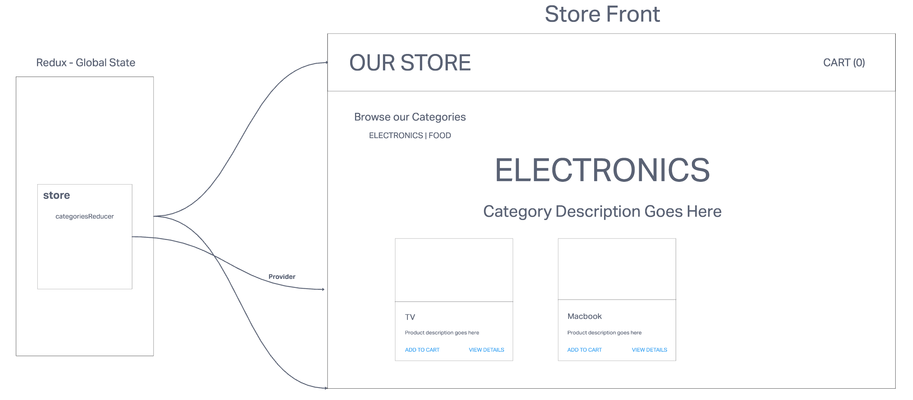

# LAB - Class 36-37

## Project: Store Front

### Author: KC Hofstetter

### Problem Domain

This application will power an online storefront that will allow our users to browse our product offerings by category, place items in their shopping cart, and check-out when they are ready to make their purchase

### Links and Resources

- [ci/cd](https://github.com/khofstetter94/storefront/pulls?q=is%3Apr+is%3Aclosed)
- [front-end application](http://xyz.com) (when applicable)

#### How to initialize/run your application (where applicable)

- In your terminal, run: b`npm start`

#### Features / Routes

The core requirements and functionality are as follows:

- Display a list of our product categories
- Display a listing of products for each category, when the category is selected
- From the product listings:
  - Click to view a full detail page about the product
  - Add the product to your shopping cart
- Shopping cart (simple version) always visible on screen
- Full shopping cart and check out screen available from main navigation

The application will be created with the following overall architecture and methodologies

- React
- ES6 Classes
- Redux Store for Application State
- Deployed API with MongoDB storage for storing categories and products
- Superagent or Axios for performing API Requests
- Material UI for layout and styling
- Test Driven Development, using Jest
- Deployment to a cloud provider (Netlify, Amplify, or GitHub Pages)

#### Tests

- In your terminal, run:  `npm test categories.test.js`

#### UML

